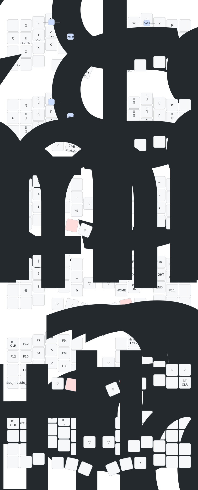

# Cornix カスタムキーマップ

Cornix スプリットキーボード用 ZMK ファームウェアの個人カスタムキーマップ。

## 概要

| 項目           | 内容                                                                     |
| -------------- | ------------------------------------------------------------------------ |
| 英字配列       | 大西配列（改造版）                                                       |
| 日本語配列     | 薙刀式（改造版）                                                         |
| 記号配列       | おさかなキーボードのデフォルトキーマップを改変（シェル・Vim 操作最適化） |
| ファームウェア | ZMK firmware                                                             |

## 設計背景

### ユースケース

- **Vim / シェル操作**：コマンドライン・テキスト編集を主軸に置いた配列。`/` `|` `!` `>` `<` `\` などシェルや Vim で頻出する記号を記号レイヤーに集中配置
- **プログラミング**：括弧類（`{}` `[]` `()`）、比較・代入演算子（`=` `<` `>`）、コメント記号（`#` `//`）を打ちやすい位置に配置
- **日本語テキスト執筆**：薙刀式による日本語入力効率化

### 移植性

おさかなキーボードへの移植を見据えた設計。ZMK ベースで実装しているため、同等のレイアウトを持つキーボードへの移植コストを低く保てる。
おさかなキーボードの物理キー配置に合わせた論理キーマップである。  

### キー配列の選定理由

| 配列     | 採用理由                                                        |
| -------- | --------------------------------------------------------------- |
| 大西配列 | 英語・コード入力時の指移動距離を削減。最初に学んだ新配列。      |
| 薙刀式   | かな入力系新配列でアルペジオ重視。                              |
| HRM      | Ctrl / Alt / GUI をホーム行に統合し、小指での修飾キー操作を排除 |

---

## ハードウェア

| 項目       | 仕様                          |
| ---------- | ----------------------------- |
| キー数     | 50キー（左右各25キー）        |
| スイッチ   | Kailh Choc v2                 |
| 通信       | BLE 5.0 / USB-C（左半分のみ） |
| スプリット | 左半分がセントラル（親機）    |

## レイヤー構成

| 番号 | 名前   | 用途                     | 起動方法               |
| ---- | ------ | ------------------------ | ---------------------- |
| 0    | BASE   | 英字入力（大西配列改変） | デフォルト             |
| 1    | NAGI   | 日本語入力（薙刀式）     | H+J コンボ             |
| 2    | LOWER  | 数字・記号               | 左親指ホールド         |
| 3    | RAISE  | 括弧・矢印・Fn           | 右親指ホールド         |
| 4    | ADJUST | Fn・マウス操作           | LOWER + RAISE 同時押し |

## キーマップ可視化



> 各キーに2段表示がある場合、上段が単打、下段がスペースシフト（Space 同時押し）での出力。

### 手動での再生成

```bash
just docker-draw          # cornix（デフォルト）
just docker-draw cornix   # キーボード名を明示
```

`docker` のみ必要（`keymap-drawer` のローカルインストール不要）。

---

## Layer 0: BASE（大西配列改変版）

### 設計コンセプト

- **ベース配列**：大西配列をベースに個人的な改変を加えた英字効率配列
- **特徴**：母音（E / I / A / O）を左手中段（ホームポジション）に集中配置。U は左手上段
- **HRM（Home Row Mods）**：左中段と右中段のホーム行キーに修飾キーを統合。タップで通常キー、ホールドで修飾キーとして動作
- **親指レイヤー**：左親指で Space（+Shift）、右親指で Enter（+Shift）。ホールドでレイヤー切替

---

## Layer 1: NAGI（薙刀式改造版）

### 設計コンセプト

- **薙刀式**：親指シフトを使った日本語入力方式。Space / Enter を親指シフトキーとして使用し、シフトあり・なしで異なる文字を入力する
- **ZMK 実装**：各キーに `&ng` マクロ（ZMK Naginata ビヘイビア）を適用。物理キー位置は QWERTY 配列のまま
- **改造点**：HRM を廃止し `&ng` プレーンキーに統一。薙刀式の親指シフトと HRM のタイミング競合を排除
- **薙刀式 ON / OFF**：コンボキーで切替（→ [コンボ一覧](#コンボ一覧) 参照）

---

## Layer 2: LOWER（数字・記号）

### 設計コンセプト

- **ベース**：おさかなキーボードのデフォルトキーマップを参考に改変
- **左手**：テンキー配置で数字（0〜9）を配置。タイピング中に数字を入力しやすいよう最適化
- **右手**：シェル操作・Vim 操作で多用する記号を最適配置
  - シェル特殊文字： `.` `~` `/` `!` `|` `\` `>` `<` `*`
  - Vim 操作：`/` `?`（検索）、`:`（コマンド）、`.`（繰り返し）、`;`

---

## Layer 3: RAISE（括弧・矢印・Fn）

### 設計コンセプト

- **左手**：コーディングで使用する括弧類を網羅。開閉ペアを隣接配置
- **右手**：Vimの配置の矢印キーとナビゲーション（HOME / END / PGUP / PGDN）。よく使うFn キー

---

## Layer 4: ADJUST（Fn・マウス）

LOWER + RAISE を同時押しで起動。

- **左手**：Fn キー（F1〜F9）、CapsLock
- **右手**：マウス操作（左右クリック、カーソル移動）
- **Bluetooth**：プロファイル切替（BT0〜BT2）、接続解除

---

## コンボ一覧

| コンボ       | キー            | 機能                                           | 有効レイヤー |
| ------------ | --------------- | ---------------------------------------------- | ------------ |
| 薙刀式 ON    | `H` + `J`       | NAGI レイヤーへ切替・日本語入力モード開始      | BASE         |
| 薙刀式 OFF   | `F` + `G`       | BASE レイヤーへ戻る・英字入力モードへ          | BASE / NAGI  |
| ESC + 英字   | `W` + `R`       | ESC 送信 + 英字入力モード切替                  | BASE / NAGI  |
| 英字モード   | `X` + `C`       | OS 入力モードを英字に変更 + BASE レイヤーへ切替 | 全レイヤー   |
| 日本語モード | `M` + `J`       | レイヤー切替なしで OS 入力モードを日本語に変更 | 全レイヤー   |
| ⇧ + Enter    | 左親指 + 右親指 | Shift + Enter                                  | NAGI         |

> **薙刀式 ON/OFF コンボ**はレイヤー切替と OS 入力モード変更を同時に行う。**英字/日本語モード コンボ**はレイヤーを変えず OS 側の入力モードだけを切り替えるため、どのレイヤーからでも使える。

---

## HRM（Home Row Mods）詳細設定

### タイミング定数

| 定数                   | 値    | 用途                             |
| ---------------------- | ----- | -------------------------------- |
| `HM_TAPPING_TERM`      | 250ms | Ctrl / Alt / GUI 用              |
| `HM_TAPPING_TERM_FAST` | 200ms | Shift 用                         |
| `HM_PRIOR_IDLE`        | 70ms  | 通常 HRM の require-prior-idle   |
| `HM_PRIOR_IDLE_NG`     | 250ms | 薙刀式 HRM の require-prior-idle |

### ビヘイビア一覧

| ビヘイビア   | flavor        | 対象修飾子          | 備考                           |
| ------------ | ------------- | ------------------- | ------------------------------ |
| `hm_l`       | tap-preferred | 左 Ctrl / Alt / GUI | `hold-trigger-on-release` 有効 |
| `hm_r`       | tap-preferred | 右 Ctrl / Alt / GUI | `hold-trigger-on-release` 有効 |
| `hm_shift_l` | balanced      | 左 Shift            | prior-idle 70ms                |
| `hm_shift_r` | balanced      | 右 Shift            | prior-idle 70ms                |

> 薙刀式レイヤー（NAGI）では HRM を廃止し、すべて `&ng` プレーンキーに統一している（タイミング競合を排除するため）。

---

## ビルドとフラッシュ

### ビルドコマンド

```bash
just list              # ビルドターゲット一覧
just build cornix_left   # 左半分をビルド
just build cornix_right  # 右半分をビルド
just build all           # 全ターゲットをビルド
just clean             # ビルドキャッシュと成果物を削除
just init              # west 初期化（初回セットアップ）
just update            # west 依存関係を更新
```

> ビルドには `ZMK_LIB_PREFIX` 環境変数に ZMK ライブラリの親ディレクトリを設定する必要がある。

### フラッシュ手順

1. リセットボタンをダブルタップして UF2 ブートローダーモードに入る
2. `firmware/cornix_left.uf2` を左半分にドラッグ＆ドロップ
3. `firmware/cornix_right.uf2` を右半分にドラッグ＆ドロップ
4. 両半分を同時にリセット

> v2.3 以降は SoftDevice の復元不要。直接フラッシュ可能。

---

## ファイル構成

```
.
├── config/
│   ├── cornix.keymap      # メインのキーマップ設定
│   ├── *.conf             # ZMK 設定ファイル
│   └── *.dtsi             # デバイスツリー定義
├── boards/jzf/cornix/     # ボード定義ファイル
├── firmware/              # ビルド成果物（.uf2）出力先
├── Justfile               # ビルドコマンド定義
├── build.yaml             # ビルドターゲット定義
├── CLAUDE.md              # AI エージェント向け設計ドキュメント
└── flake.nix              # Nix 開発環境
```
